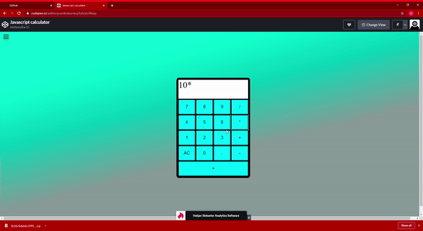

# Js-calculator

## What I created

This is a calculator that is able to solve simple math equations. 

## What I learned

* How to use React components.
* How to change states based on the changes the user makes.
* How to design a calculator application.
